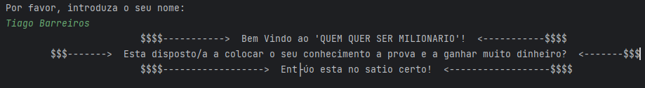
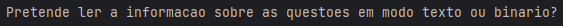
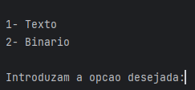
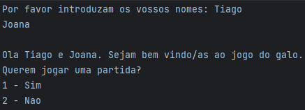
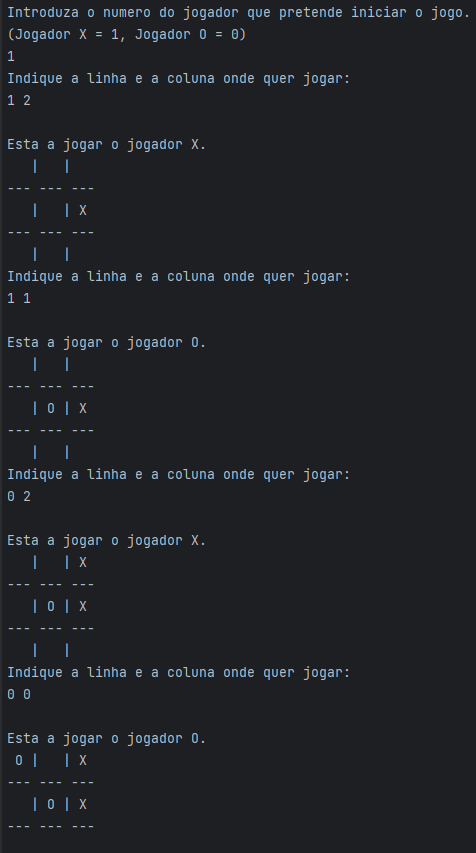

<a name="readme-top"></a>

<div align="center">

# 

</div>

# Quem Quer Ser Milionário?

<table>
<tr>
<td>
  O objetivo deste trabalho é implementar em C um programa que simule uma versão simplificada deste concurso e que permita gerir as questões do concurso, bem como registar dados dos participantes e resultados obtidos.
</td>
</tr>
</table>

### Ferramentas e Tecnologias

[![C++][C++]][C++-url] [![VS-Code][VS-Code]][VS-Code-url] 

<!-- 
[![Next][Next.js]][Next-url] [![React][React.js]][React-url] [![Bootstrap][Bootstrap.com]][Bootstrap-url] [![JQuery][JQuery.com]][JQuery-url]
-->

### Repositório GitHub

Após a entrega deste projeto ficará publico :  https://github.com/tiago-barreiros/Quem-Quer-Ser-Milionario

## Aplicação

### Introdução
<div align="center">



</div>





<!-- 
### Menu introdutório
<div align="center">



</div>

### Jogo
<div align="center">



</div>
-->

<!-- 
### Página de Login


### Página de Registo


### Recuperar Password


### Landing Page


### Contratos


### Feedbacks


### Página Pessoal


### Reservar


### Calendário


### Planta do Cowork


### Ambiente da Administração


### Alguns Recursos


-->

### Como usar executar App?

- Deverá ser compilado utilizando o comando:
   ```sh
   gcc -o qqsm main main.c -Wall -std=c99
   ```

<!-- 
- Acede ao website no URL de um browser: https://cowork-fundao.web.app/
-->

## Documentação

- [C](https://www.learn-c.org/)
- [C++](https://www.cplusplus.com/doc/tutorial/)

<!-- 
- [React](https://reactjs.org/docs/getting-started.html)
- [react-router-dom](https://reactrouter.com/web/guides/quick-start)
- [npm](https://www.npmjs.com/)
- [DataPicker](https://hypeserver.github.io/react-date-range/)
- [Date and Time Pickers - Validation](https://mui.com/x/react-date-pickers/validation/)
- [headless UI](https://headlessui.com/)
- [tailwindcss](https://v2.tailwindcss.com/docs/installation)
- [Firebase](https://firebase.google.com/docs)
-->

## Equipa de Desenvolvimento

[](https://github.com/tiago-barreiros)
----------------------------------------------------------------------------------------------------------------------
[Tiago Barreiros](https://github.com/tiago-barreiros)

# Orientação

## [Prof. Doutora Alexandra Mendes](https://archimendes.com/)

## *Programação* @[Universidade da Beira Interior](https://www.ubi.pt/).

<!-- 
### Installation

_Below is an example of how you can instruct your audience on installing and setting up your app. This template doesn't rely on any external dependencies or services._

1. Get a free API Key at [https://example.com](https://example.com)
2. Clone the repo
   ```sh
   git clone https://github.com/your_username_/Project-Name.git
   ```
3. Install NPM packages
   ```sh
   npm install
   ```
4. Enter your API in `config.js`
   ```js
   const API_KEY = 'ENTER YOUR API';
   ```

<p align="right">(<a href="#readme-top">back to top</a>)</p>
-->

<!-- LICENSE -->
## License

Distributed under the MIT License. See `LICENSE.txt` for more information.

<!-- CONTACT -->
## Contact

<div> 
   <a href = "mailto:tiago.m.barreiros@gmail.com"></a>
  <a href="https://www.linkedin.com/in/tiago-barreiros/" target="_blank"></a> 
   <a href="https://discord.gg/537381363486031873" target="_blank"></a>
</div>

<p align="right">(<a href="#readme-top">back to top</a>)</p>

<!-- MARKDOWN LINKS & IMAGES -->
<!-- https://www.markdownguide.org/basic-syntax/#reference-style-links -->
[contributors-shield]: https://img.shields.io/github/contributors/othneildrew/Best-README-Template.svg?style=for-the-badge
[contributors-url]: https://github.com/othneildrew/Best-README-Template/graphs/contributors
[forks-shield]: https://img.shields.io/github/forks/othneildrew/Best-README-Template.svg?style=for-the-badge
[forks-url]: https://github.com/othneildrew/Best-README-Template/network/members
[stars-shield]: https://img.shields.io/github/stars/othneildrew/Best-README-Template.svg?style=for-the-badge
[stars-url]: https://github.com/othneildrew/Best-README-Template/stargazers
[issues-shield]: https://img.shields.io/github/issues/othneildrew/Best-README-Template.svg?style=for-the-badge
[issues-url]: https://github.com/othneildrew/Best-README-Template/issues
[license-shield]: https://img.shields.io/github/license/othneildrew/Best-README-Template.svg?style=for-the-badge
[license-url]: https://github.com/othneildrew/Best-README-Template/blob/master/LICENSE.txt
[linkedin-shield]: https://img.shields.io/badge/-LinkedIn-black.svg?style=for-the-badge&logo=linkedin&colorB=555
[linkedin-url]: https://linkedin.com/in/othneildrew
[Next.js]: https://img.shields.io/badge/next.js-000000?style=for-the-badge&logo=nextdotjs&logoColor=white
[Next-url]: https://nextjs.org/
[React.js]: https://img.shields.io/badge/React-20232A?style=for-the-badge&logo=react&logoColor=61DAFB
[React-url]: https://reactjs.org/
[C++]: https://img.shields.io/badge/C++-00599C?style=for-the-badge&logo=cplusplus&logoColor=white
[C++-url]: https://www.cplusplus.com/
[VS-Code]: https://img.shields.io/badge/VS_Code-0078D4?style=for-the-badge&logo=visualstudiocode&logoColor=white
[VS-Code-url]: https://code.visualstudio.com/
[Vue.js]: https://img.shields.io/badge/Vue.js-35495E?style=for-the-badge&logo=vuedotjs&logoColor=4FC08D
[Vue-url]: https://vuejs.org/
[Angular.io]: https://img.shields.io/badge/Angular-DD0031?style=for-the-badge&logo=angular&logoColor=white
[Angular-url]: https://angular.io/
[Svelte.dev]: https://img.shields.io/badge/Svelte-4A4A55?style=for-the-badge&logo=svelte&logoColor=FF3E00
[Svelte-url]: https://svelte.dev/
[Laravel.com]: https://img.shields.io/badge/Laravel-FF2D20?style=for-the-badge&logo=laravel&logoColor=white
[Laravel-url]: https://laravel.com
[Bootstrap.com]: https://img.shields.io/badge/Bootstrap-563D7C?style=for-the-badge&logo=bootstrap&logoColor=white
[Bootstrap-url]: https://getbootstrap.com
[JQuery.com]: https://img.shields.io/badge/jQuery-0769AD?style=for-the-badge&logo=jquery&logoColor=white
[JQuery-url]: https://jquery.com 
